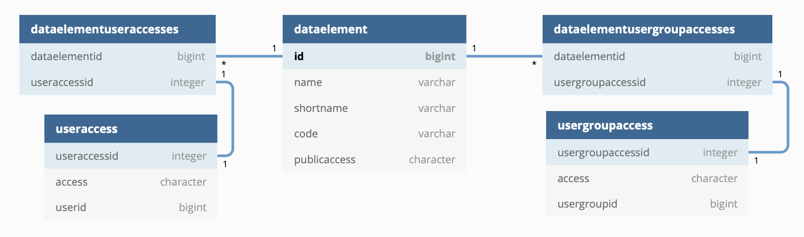
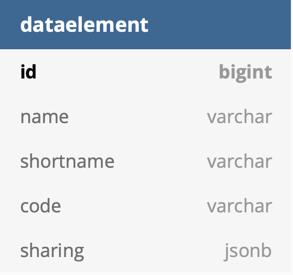

# Sharing model

## Motivation
Current Sharing data model has some disadvantages such as:
- Introduced too many tables in database. Each sharing object has two table `*useraccesses` and `*usergroupaccesses`. Total 96 tables in DHIS2 database.
- Querying objects with sharing enabled also required joining those two tables, which is slow.

- Below is the current Sharing model diagram for `DataElement`
<p align="center">

</p>

## Introducing new Jsonb column
- To solve the issue, we are replacing the sharing tables with one new column for each object's table with sharing enabled. With that, we can drop all 96 legacy tables
<p align="center">

</p>

- Below is the format of the new `sharing` property. It will be included in the response together with the legacy `useraccesses` and `usergroupaccesses` properties. This is for backward compatibility.
```
    {
        "sharing": {
            "owner": "GOLswS44mh8",
            "external": false,
            "public": "rwrw----",
            "users": {
                "xE7jOejl9FI": {
                    "access": "rw------",
                    "id": "xE7jOejl9FI"
                }
            },
            "userGroups": {
                "tH0GcNZZ1vW": {
                    "access": "rwrw----",
                    "id": "tH0GcNZZ1vW"
                },
                "Rg8wusV7QYi": {
                    "access": "rw------",
                    "id": "Rg8wusV7QYi"
                }
            }
        }
    }
```
## Introduce  `owner` property
- We also introduced a new `owner` property inside `sharing`. This contains UID of the `User` who owns the object. 
- Current `user` property's name will be changed to `createdBy`. This property is  immutable. 
- ACL service will check sharing access using this `owner` property.
- Object's owner can be changed/transfered to other `User`

- Currently the `onwer` value is copied from the `user` for backward compatibility. But this will be changed after we decided on the design of managing features of this property.

## Migration
Added Flyway script
- Copy all current sharing data to new jsonb column.
- Delete all legacy tables ( 96 tables ).

## Effects on current sharing api
- This change doesn't modify current `/api/sharing` endpoint. It will work the same as before, consuming same payload format and produce same response.
- In the backend, all incomming sharing data will be converted to the new format and save to new jsonb columns.

## New `/sharing` Endpoint
- For saving `sharing` with new format, send PUT request to `/api/dataElements/sharing` with new payload as below.

```
{
  "owner": "GOLswS44mh8",
  "external": true,
   "users": {
        "xE7jOejl9FI": {
            "access": "rw------",
            "id": "xE7jOejl9FI"
        }
    },
  "userGroups": {
        "tH0GcNZZ1vW": {
            "access": "rwrw----",
            "id": "tH0GcNZZ1vW"
        },
        "Rg8wusV7QYi": {
            "access": "rw------",
            "id": "Rg8wusV7QYi"
        }
  },
  "public": "rw------"
}
```


